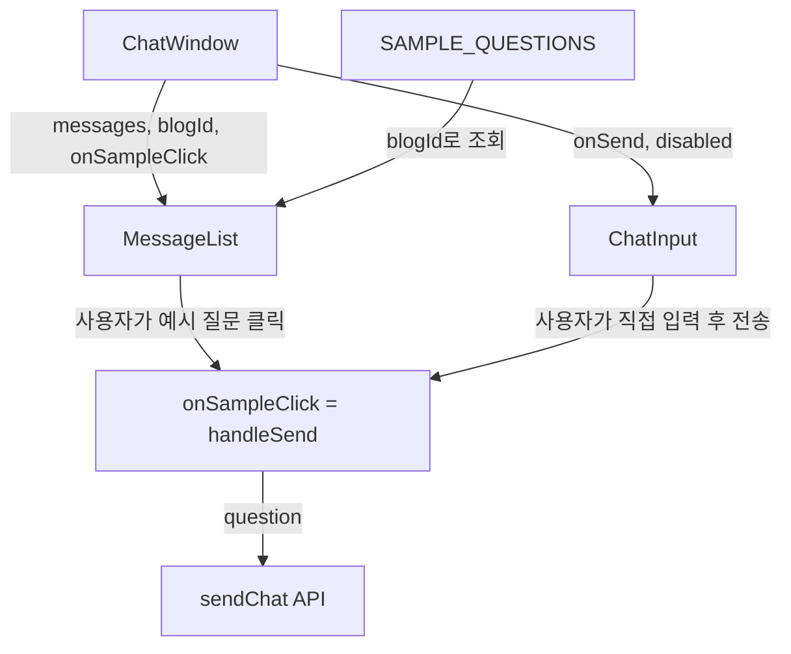

# 구현 계획: AI Chatbot 예시 질문 & 입력 UI 개선

## 변경 파일 요약

| 파일 | 변경 유형 | 설명 |
|------|----------|------|
| `frontend/src/constants/sampleQuestions.ts` | 신규 | 블로그별 예시 질문 상수 |
| `frontend/src/components/MessageList.tsx` | 수정 | 빈 화면 → 예시 질문 카드 UI |
| `frontend/src/components/ChatInput.tsx` | 수정 | 둥근 입력창 + 내부 전송 아이콘 |
| `frontend/src/components/ChatWindow.tsx` | 수정 | 예시 질문 클릭 핸들러 연결 |

## 1. 예시 질문 상수 파일 (신규)

**파일**: `frontend/src/constants/sampleQuestions.ts`

```typescript
export const SAMPLE_QUESTIONS: Record<string, string[]> = {
  "blog-v2": [
    "Go 관련 글이 있나요?",
    "Spring Boot 시리즈 추천해줘",
    "최근 작성된 글 알려줘",
    "Docker 관련 글 요약해줘",
  ],
  investment: [
    "배당주 관련 글이 있나요?",
    "ETF 투자 전략에 대해 알려줘",
    "최근 시장 분석 글 있어?",
    "포트폴리오 관련 글 추천해줘",
  ],
  inspireme: [
    "오늘의 명언 추천해줘",
    "도전과 용기에 관한 명언 알려줘",
    "스티브 잡스 명언이 있나요?",
    "힘이 되는 짧은 명언 추천해줘",
  ],
};
```

## 2. MessageList.tsx 수정

**핵심 변경**: 빈 화면(`messages.length === 0`)일 때 예시 질문 카드를 표시

### 현재 코드 (55-60행)
```tsx
if (messages.length === 0 && !isLoading) {
  return (
    <div className="flex-1 flex items-center justify-center text-muted-foreground">
      <p>블로그에 대해 질문해 보세요!</p>
    </div>
  );
}
```

### 변경 후
- props에 `onSampleClick: (question: string) => void` 추가
- props에 `blogId`는 이미 있으므로 그대로 활용
- 빈 화면을 아이콘 + 안내 메시지 + 예시 질문 카드 리스트로 교체

```tsx
// 빈 화면 부분만 변경
if (messages.length === 0 && !isLoading) {
  const questions = SAMPLE_QUESTIONS[blogId] ?? SAMPLE_QUESTIONS["blog-v2"];
  return (
    <div className="flex-1 flex flex-col items-center justify-center px-4">
      {/* 아이콘 + 안내 메시지 */}
      <div className="mb-8 text-center">
        <MessageSquare className="mx-auto mb-3 h-10 w-10 text-muted-foreground" />
        <p className="text-muted-foreground">블로그에 대해 질문해 보세요</p>
      </div>

      {/* 예시 질문 카드 */}
      <div className="w-full max-w-lg space-y-3">
        <p className="text-sm font-medium text-muted-foreground">예시 질문</p>
        {questions.map((q, i) => (
          <button
            key={i}
            onClick={() => onSampleClick(q)}
            className="w-full text-left rounded-lg border bg-card p-3 text-sm
                       hover:bg-accent transition-colors"
          >
            {q}
          </button>
        ))}
      </div>
    </div>
  );
}
```

**스타일 포인트**:
- 카드: `rounded-lg border bg-card` — 기존 shadcn 테마 토큰 사용으로 다크모드 자동 대응
- hover: `hover:bg-accent` — 클릭 가능함을 시각적으로 표현
- 최대 너비: `max-w-lg` (512px) — 카드가 너무 넓어지지 않도록 제한

## 3. ChatWindow.tsx 수정

**핵심 변경**: `MessageList`에 `onSampleClick` prop 전달

### 현재 코드 (65행)
```tsx
<MessageList messages={messages} isLoading={isLoading} blogId={blogId} />
```

### 변경 후
```tsx
<MessageList
  messages={messages}
  isLoading={isLoading}
  blogId={blogId}
  onSampleClick={handleSend}
/>
```

- `handleSend`를 그대로 전달 — 예시 질문 클릭 시 바로 질문이 전송됨
- 추가 상태나 로직 불필요

## 4. ChatInput.tsx 수정

**핵심 변경**: Google Scholar 스타일 둥근 입력창 + 내부 전송 아이콘

### 현재 코드
```tsx
<form onSubmit={handleSubmit} className="flex gap-2 p-4 border-t">
  <Input ... className="flex-1" />
  <Button type="submit" ...>전송</Button>
</form>
```

### 변경 후
```tsx
<form onSubmit={handleSubmit} className="p-4">
  <div className="relative mx-auto max-w-2xl">
    <Input
      value={input}
      onChange={(e) => setInput(e.target.value)}
      placeholder="블로그에 질문하기"
      disabled={disabled}
      className="rounded-full py-3 pl-4 pr-12 shadow-sm"
    />
    <Button
      type="submit"
      size="icon"
      disabled={disabled || !input.trim()}
      className="absolute right-1.5 top-1/2 -translate-y-1/2 h-8 w-8 rounded-full"
      aria-label="전송"
    >
      <Send className="h-4 w-4" />
    </Button>
  </div>
</form>
```

**스타일 포인트**:
- `rounded-full`: 완전한 둥근 모서리
- `pr-12`: 오른쪽에 전송 버튼 공간 확보
- `shadow-sm`: 부드러운 그림자로 입력창 강조
- `max-w-2xl mx-auto`: 중앙 정렬 + 최대 너비 제한
- `border-t` 제거 → 구분선 없이 깔끔한 레이아웃
- Send 아이콘: lucide-react의 `Send` (이미 프로젝트에서 사용 중)

## 컴포넌트 간 데이터 흐름


