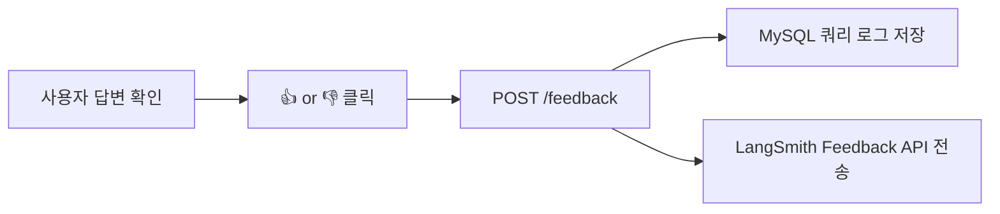
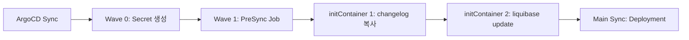

# RAG 챗봇 모니터링 - 프로젝트 PRD

## 1. 개요

### 1.1 목적
RAG 챗봇(`ai-chatbot.advenoh.pe.kr`)의 품질을 상시 모니터링하기 위해 사용자 피드백, 쿼리 로그, Admin 대시보드를 구축한다.

### 1.2 선행 조건
- `ai-chatbot.advenoh.pe.kr` API 서버 배포 완료 (`6_chatbot_project_prd.md`)
- LangSmith 트레이싱 연동 완료 (6_ M4)

### 1.3 관련 Repo
- **Repo**: [ai-chatbot.advenoh.pe.kr](https://github.com/kenshin579/ai-chatbot.advenoh.pe.kr)
- Backend: `backend/` (FastAPI)
- Frontend: `frontend/` (Next.js)

---

## 2. 핵심 기능

1. **사용자 피드백 (👍👎)**: 각 답변에 피드백 버튼, LangSmith Feedback API 연동
2. **쿼리 로그**: 모든 `/chat` 요청을 MySQL에 기록
3. **Admin 대시보드**: `ai-chatbot.advenoh.pe.kr/admin`에서 통계 확인

---

## 3. 사용자 피드백 (👍👎)

### 3.1 동작 흐름



### 3.2 API

```python
# backend/app/api/models.py
class FeedbackRequest(BaseModel):
    message_id: str
    blog_id: str
    question: str
    rating: Literal["up", "down"]  # 👍 / 👎
```

```
POST /feedback
{
  "message_id": "run-xxxx",
  "blog_id": "blog-v2",
  "question": "Go에서 goroutine이란?",
  "rating": "up"
}
```

### 3.3 LangSmith 연동

- `/chat` 응답에 `message_id` (LangSmith run_id) 포함
- `/feedback` 호출 시 해당 run_id에 피드백 점수 연결
- LangSmith 대시보드에서 피드백 기반 품질 추이 확인 가능

---

## 4. 쿼리 로그

### 4.1 저장소

- **MySQL** 사용 (K8s 클러스터에 이미 배포된 MySQL 서버 활용)
- 호스트: `mysql-headless.app.svc.cluster.local:3306`
- 데이터베이스: `ai_chatbot` (신규 생성 필요)
- **DB 생성**: 운영 중인 MySQL에 1회 수동 생성 (`kubectl exec`) + `charts/mysql/values.yaml` initdbScripts에 추가 (향후 재생성 대비)
- **스키마 관리**: Liquibase로 테이블 관리, ArgoCD PreSync Job으로 자동 실행 (inspireme-be, moneyflow-be와 동일 패턴)

### 4.2 스키마 (Liquibase Changeset)

Liquibase changelog 구조 (`backend/liquibase/`):

```
backend/liquibase/
├── changelog.yaml              # 메인 changelog 설정
├── liquibase.properties        # 로컬 개발용 설정
├── lib/
│   ├── mysql-connector-j-8.4.0.jar
│   └── liquibase-natural-comparator.jar
└── changes/
    └── 2026-02/
        ├── 1-create_query_logs.sql
        └── 2-create_feedbacks.sql
```

```sql
-- liquibase formatted sql
-- changeset kenshin579:#1-create-query-logs

CREATE TABLE query_logs (
    id BIGINT AUTO_INCREMENT PRIMARY KEY,
    message_id VARCHAR(255) NOT NULL,
    blog_id VARCHAR(100) NOT NULL,
    question TEXT NOT NULL,
    answer TEXT NOT NULL,
    sources JSON,                -- JSON 배열
    response_time_ms INT,        -- 응답 시간 (ms)
    has_results BOOLEAN,         -- 검색 결과 존재 여부
    created_at TIMESTAMP DEFAULT CURRENT_TIMESTAMP,
    INDEX idx_blog_id (blog_id),
    INDEX idx_created_at (created_at)
) ENGINE=InnoDB DEFAULT CHARSET=utf8mb4 COLLATE=utf8mb4_0900_ai_ci;

--rollback DROP TABLE query_logs;
```

```sql
-- liquibase formatted sql
-- changeset kenshin579:#2-create-feedbacks

CREATE TABLE feedbacks (
    id BIGINT AUTO_INCREMENT PRIMARY KEY,
    message_id VARCHAR(255) NOT NULL,
    blog_id VARCHAR(100) NOT NULL,
    question TEXT NOT NULL,
    rating VARCHAR(10) NOT NULL,  -- "up" | "down"
    created_at TIMESTAMP DEFAULT CURRENT_TIMESTAMP,
    INDEX idx_message_id (message_id),
    INDEX idx_created_at (created_at)
) ENGINE=InnoDB DEFAULT CHARSET=utf8mb4 COLLATE=utf8mb4_0900_ai_ci;

--rollback DROP TABLE feedbacks;
```

### 4.3 ArgoCD PreSync 실행

배포 시 ArgoCD PreSync Job이 Liquibase migration을 자동 실행한다 (inspireme-be, moneyflow-be와 동일 패턴).



### 4.3 로깅 위치

- `/chat` 엔드포인트: 매 요청마다 `query_logs` 테이블에 기록
- `/feedback` 엔드포인트: 매 피드백마다 `feedbacks` 테이블에 기록

---

## 5. Admin 대시보드

### 5.1 접근

- **URL**: `ai-chatbot.advenoh.pe.kr/admin`
- **인증**: 간단한 토큰 인증 (환경변수 `ADMIN_TOKEN`)

### 5.2 대시보드 표시 항목

| 카테고리 | 지표 | 설명 |
|----------|------|------|
| 사용 통계 | 일별/주별 질문 수 | 기간별 사용량 추이 차트 |
| 사용 통계 | 블로그별 질문 비율 | blog-v2 vs investment 비율 |
| 인기 질문 | TOP 10 질문 | 가장 많이 물어본 질문 목록 |
| 품질 지표 | 피드백 점수 (👍👎 비율) | 사용자 만족도 추이 |
| 품질 지표 | 검색 실패율 | 관련 문서를 못 찾은 비율 |
| 품질 지표 | 평균 응답 시간 | retrieval + generation 소요 시간 |
| 인덱싱 현황 | Collection별 문서 수 | 인덱싱된 청크 수 |
| 인덱싱 현황 | 마지막 인덱싱 시각 | 최근 갱신 시점 |
| 비용 | 토큰 사용량 / 비용 | 일별 OpenAI API 비용 추적 (LangSmith 연동) |

### 5.3 Backend API

```python
# backend/app/api/routes.py
@router.get("/admin/stats")
async def get_stats(token: str = Depends(verify_admin_token)):
    """Admin 대시보드 통계 데이터 반환"""
    return {
        "daily_queries": query_log.get_daily_counts(),
        "top_questions": query_log.get_top_questions(limit=10),
        "feedback_score": query_log.get_feedback_ratio(),
        "avg_response_time": query_log.get_avg_response_time(),
        "search_failure_rate": query_log.get_search_failure_rate(),
        "collections": vector_store_manager.get_collection_stats(),
    }
```

### 5.4 Frontend 구조

```
frontend/src/
├── app/
│   └── admin/
│       └── page.tsx              # Admin 대시보드 페이지
└── components/
    └── admin/
        ├── StatsCard.tsx         # 통계 카드 (질문 수, 피드백 점수 등)
        ├── QueryChart.tsx        # 일별 질문 수 차트 (recharts)
        ├── TopQuestions.tsx       # 인기 질문 목록
        └── CollectionInfo.tsx    # 인덱싱 현황
```

### 5.5 추가 라이브러리

| 라이브러리 | 용도 |
|-----------|------|
| recharts | 차트 렌더링 (질문 수 추이, 피드백 추이) |

---

## 6. 구현 순서 (마일스톤)

| 단계 | 작업 | 산출물 |
|------|------|--------|
| M1 | Liquibase 스키마 + PreSync Job + `/chat` 로깅 연동 | 쿼리 로그 수집 |
| M2 | 사용자 피드백 API (`POST /feedback`) + LangSmith 연동 | 피드백 수집 |
| M3 | 채팅 UI에 👍👎 피드백 버튼 추가 | 피드백 UI |
| M4 | Admin 통계 API (`GET /admin/stats`) | 통계 API |
| M5 | Admin 대시보드 페이지 (`/admin`) + 차트 | 대시보드 UI |

---

## 7. 테스트

- **MCP Playwright** 사용하여 E2E 테스트:
  - 👍👎 버튼 클릭 → 피드백 저장 확인
  - `/admin` 페이지 접근 → 통계 데이터 렌더링 확인
  - 차트/카드 컴포넌트 표시 확인
